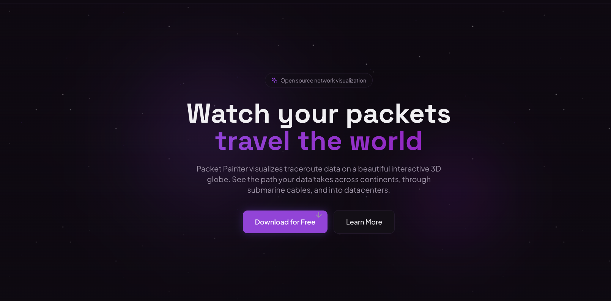

# Packet Painter

> Visualize network traceroute on an interactive 3D globe



Packet Painter is a desktop application that transforms the traditional traceroute into a stunning visual experience. Watch your packets travel across continents, traverse submarine cables, and reach datacenters around the world.

## Features

- **Real-time 3D Globe** - Watch your traceroute unfold on a beautiful interactive globe with smooth animations and intuitive pan/zoom controls
- **Latency Heatmap** - Color-coded hop indicators show latency at a glance: green for fast, yellow for medium, red for slow
- **Submarine Cables** - Toggle visibility of undersea internet cables to see how your data crosses oceans
- **Datacenter Detection** - Automatically identifies major cloud providers and datacenters along your route
- **Cross-Platform** - Native desktop app for Windows, macOS, and Linux with consistent performance
- **Open Source** - Fully open source under MIT license

## Download

| Platform | Download |
|----------|----------|
| Windows | [Packet-Painter-windows-amd64.exe](https://github.com/shaheedPCad/packet-painter/releases/latest/download/Packet-Painter-windows-amd64.exe) |
| macOS | [Packet-Painter-darwin-universal.zip](https://github.com/shaheedPCad/packet-painter/releases/latest/download/Packet-Painter-darwin-universal.zip) |
| Linux | [Packet-Painter-linux-amd64](https://github.com/shaheedPCad/packet-painter/releases/latest/download/Packet-Painter-linux-amd64) |

Or visit the [Releases](https://github.com/shaheedPCad/packet-painter/releases) page for all versions.

## How It Works

1. **Enter a Target** - Type any hostname or IP address (e.g., `google.com` or `8.8.8.8`)
2. **Start the Trace** - Click "Start Trace" and watch as each hop is discovered and plotted on the globe
3. **Explore** - Rotate the globe, hover over hops for details, and toggle submarine cables

The app uses system-level traceroute and geolocates each hop using IP geolocation services. Hops are then rendered as arcs on a 3D globe, giving you a visual representation of your network path.

## Tech Stack

- **Backend**: [Go](https://golang.org/) with [Wails](https://wails.io/) for native desktop integration
- **Frontend**: [React](https://react.dev/) + [TypeScript](https://www.typescriptlang.org/)
- **3D Globe**: [Globe.gl](https://globe.gl/) with [Three.js](https://threejs.org/)
- **Styling**: [Tailwind CSS](https://tailwindcss.com/)
- **Build**: Wails CLI for cross-platform binaries

## Development

### Prerequisites

- [Go](https://golang.org/dl/) 1.21+
- [Node.js](https://nodejs.org/) 18+
- [Wails CLI](https://wails.io/docs/gettingstarted/installation)

```bash
# Install Wails CLI
go install github.com/wailsapp/wails/v2/cmd/wails@latest
```

### Running Locally

```bash
# Clone the repository
git clone https://github.com/shaheedPCad/packet-painter.git
cd packet-painter

# Run in development mode
wails dev
```

This starts a development server with hot reload at `http://localhost:34115`.

### Building

```bash
# Build for current platform
wails build

# Build for specific platform
wails build -platform darwin/universal
wails build -platform windows/amd64
wails build -platform linux/amd64
```

Built binaries are placed in the `build/bin` directory.

### Project Structure

```
packet-painter/
├── app.go              # Go backend - traceroute logic
├── frontend/           # React frontend
│   ├── src/
│   │   ├── components/ # UI components
│   │   ├── App.tsx     # Main app component
│   │   └── Globe.tsx   # 3D globe visualization
│   └── wailsjs/        # Generated Wails bindings
├── landing/            # Landing page (separate Vite project)
└── wails.json          # Wails configuration
```

## Contributing

Contributions are welcome! Please feel free to submit a Pull Request.

## License

This project is licensed under the MIT License - see the [LICENSE](LICENSE) file for details.

## Author

Made by [shaheedPCad](https://github.com/shaheedPCad)
